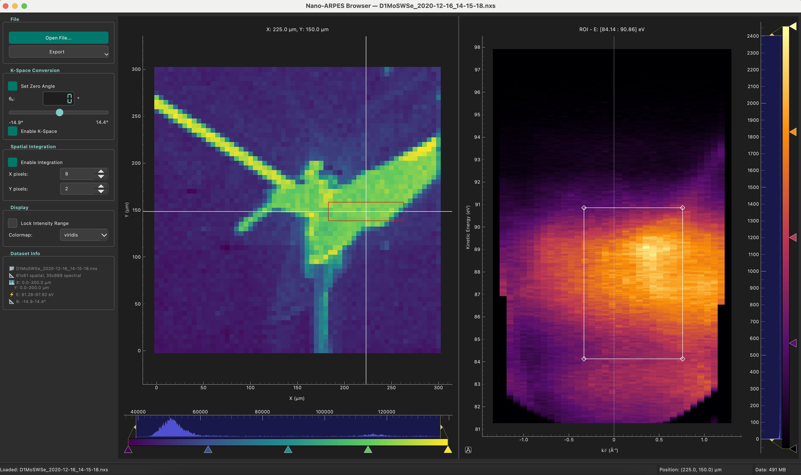

# Nano-ARPES Browser

A lightweight PyQt application for browsing and exporting **nano-/micro-ARPES 4D
datasets** from synchrotron beamlines. Current file support is focused on
**ANTARES / SOLEIL NeXus-HDF5** data with the expected
`salsaentry_1/scan_data/...` layout.

The app is built for quick inspection: select a point on the spatial map, view
the local ARPES spectrum, optionally display the spectrum in `k_parallel`, and
export the map, spectrum, selected 4D region, or full dataset.



## Install

For regular use, install from PyPI:

```bash
pip install nano-arpes-browser
nano-arpes-browser
```

With `uv`:

```bash
uv tool install nano-arpes-browser
nano-arpes-browser
```

Requires Python 3.10 or newer.

## Main Workflow

1. Open an ANTARES / SOLEIL `.nxs`, `.h5`, or `.hdf5` file.
2. Use the crosshair on the spatial map to choose a position.
3. Inspect the corresponding angle-energy ARPES spectrum.
4. Optionally enable spatial integration or k-space display.
5. Export the current map, current spectrum, selected region, or full dataset.

## What the App Shows

Internal data shape is:

```text
(y, x, angle, energy)
```

The spatial image is displayed as `rot90(sum over angle and energy)`. The raw
ANTARES X index is reversed internally; conversion between display X and data X
is handled by the dataset model.

Main views:

- **Spatial Map**: integrated intensity over the full spectrum or selected ROI.
- **ARPES Spectrum**: spectrum at the selected point or integrated spatial box.

## Features

- Interactive spatial map crosshair.
- ARPES spectrum viewer with rectangular ROI selection.
- ROI-based spatial map updates in angle-energy or k-energy mode.
- Optional spatial integration around the current position.
- Basic angle to `k_parallel` conversion.
- CSV and Igor Pro `.itx` export paths.

## Export Options

- **Spatial Map**: current displayed map as `.csv` or Igor `.itx`.
- **Spectrum**: current displayed spectrum as `.csv` or Igor `.itx`.
- **Selected Region**: compact Igor `.itx` export of a spatial subset, including
  `region_4d`, `region_spatial`, `region_spectrum`, axes, and center position.
- **Full Dataset**: Igor `.itx` export of the full cube and axes. Use only when
  you need the entire dataset.

## Physics Notes

K-space display uses the simple 1D relation:

```text
k_parallel [A^-1] = 0.5123167 * sqrt(E_kin [eV]) * sin(theta)
```

The zero-angle offset can be adjusted in the GUI. Full geometry correction,
including sample/analyzer tilt, is not yet included.

## Supported Data

Currently supported loader:

- ANTARES / SOLEIL NeXus-HDF5 files with `salsaentry_1/scan_data/...` paths.

If another beamline or HDF5 convention is needed, include the file tree, axis
metadata locations, and geometry assumptions when opening an issue.

## Development

```bash
git clone https://github.com/senkovskiy/nano-arpes-browser
cd nano-arpes-browser
make install
make run
```

Useful commands:

```bash
make test      # run pytest
make lint      # run Ruff
make format    # format with Ruff
make typecheck # run mypy
make build     # build package
```

## Documentation

- Architecture and data-flow diagrams:
  [docs/ARCHITECTURE_DIAGRAM.md](docs/ARCHITECTURE_DIAGRAM.md)

## Linux Notes

Qt on Linux may require the `xcb` platform plugin dependencies:

```bash
sudo apt update
sudo apt install -y libxcb-cursor0
```

If Qt still fails to start, also install:
`libxkbcommon-x11-0 libxcb-icccm4 libxcb-image0 libxcb-keysyms1 libxcb-randr0 libxcb-render-util0 libxcb-xinerama0 libxcb-xfixes0`.

## License

MIT. See `pyproject.toml`.
