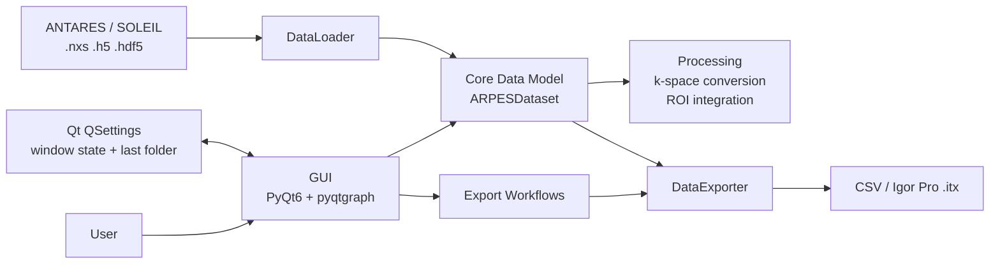
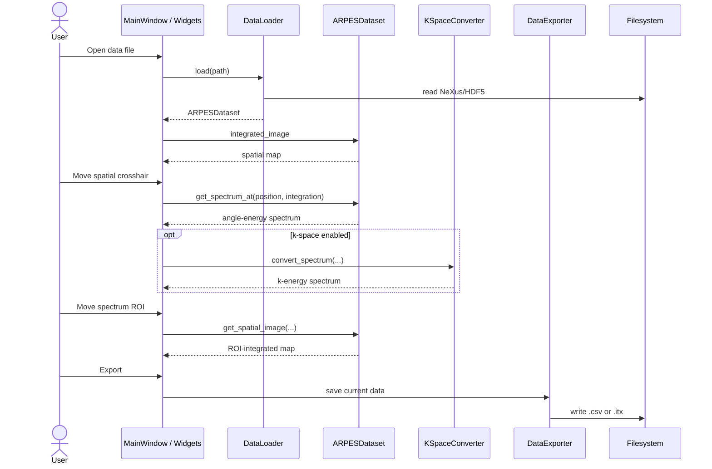
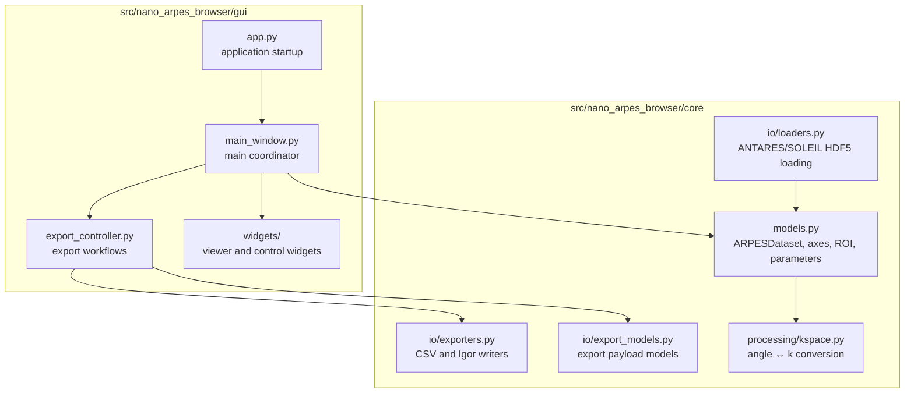

# Architecture Diagrams

This document shows how Nano-ARPES Browser is organized at a practical level:
what loads data, what displays it, what owns the scientific model, and what writes
exports.

## Big Picture

The key idea: the GUI controls interaction, but the scientific data conventions
live in the core model.

## Runtime Data Flow

## Package Boundaries

## Main Responsibilities

- `gui/app.py`: starts the Qt application.
- `gui/main_window.py`: connects widgets, dataset state, and user actions.
- `gui/export_controller.py`: handles export dialogs and prepares export payloads.
- `core/models.py`: owns array shape conventions, coordinate mapping, ROI slicing,
  spatial images, and spectrum extraction.
- `core/io/loaders.py`: loads supported ANTARES / SOLEIL NeXus-HDF5 files.
- `core/io/exporters.py`: writes CSV and Igor Pro `.itx` files.
- `core/processing/kspace.py`: performs the current angle-to-k conversion.

## Important Boundary

`core/` should remain independent of PyQt6 and pyqtgraph. This keeps data
loading, slicing, conversion, and export logic testable without starting the GUI.
